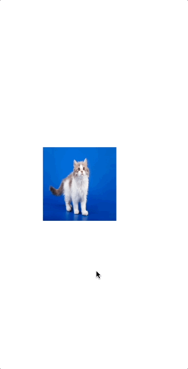

# PopupImageView


## Usage
```swift
let imageView = PopupImageView()
imageView.image = UIImage(named: "cat")
```


## Screenshot


## Installation
### SPM
Using [Swift Package Manager](https://www.swift.org/documentation/package-manager/):
```swift
dependencies: [
    .package(url: "https://github.com/doremin/PopupImageView.git", .upToNextMajor(from: "0.1.0"))
]
```

## Author
doremin, <doremin98@gmail.com>

## License
PopupImageView is released under the MIT license. See [LICENSE](LICENSE) for details.
